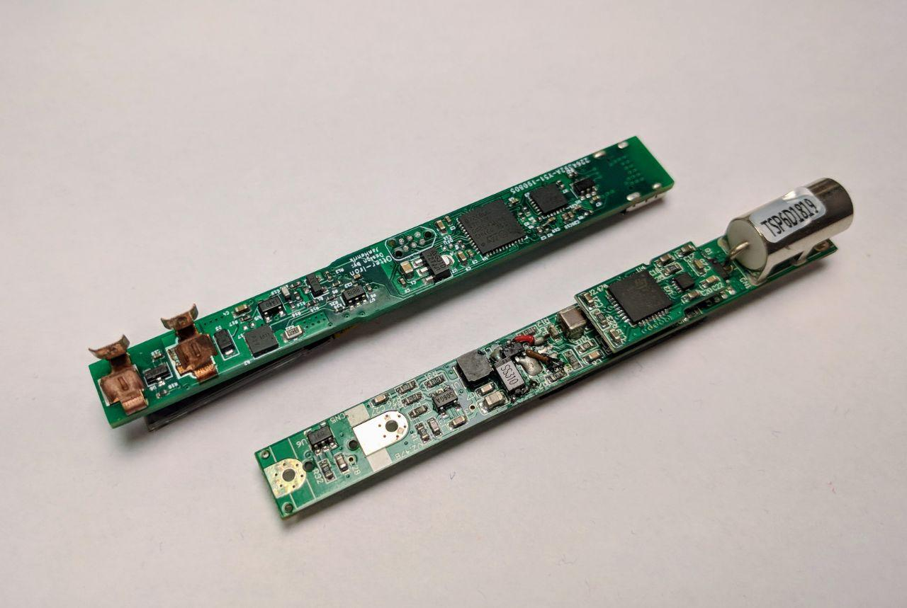
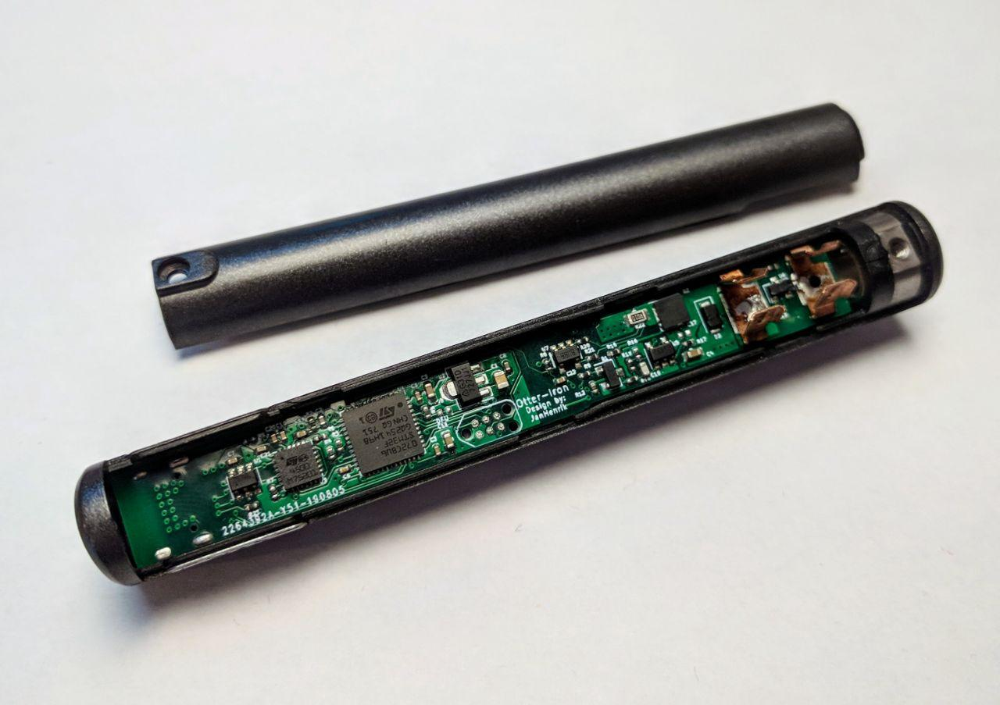
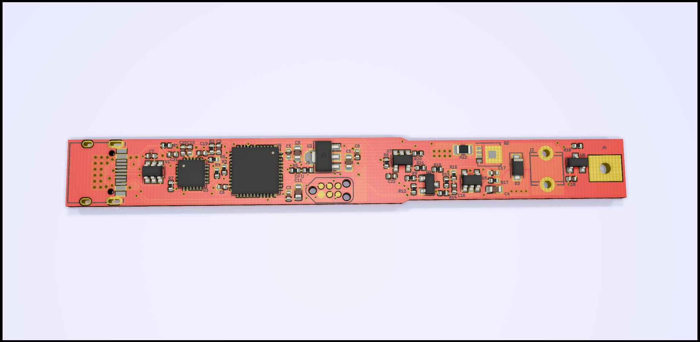
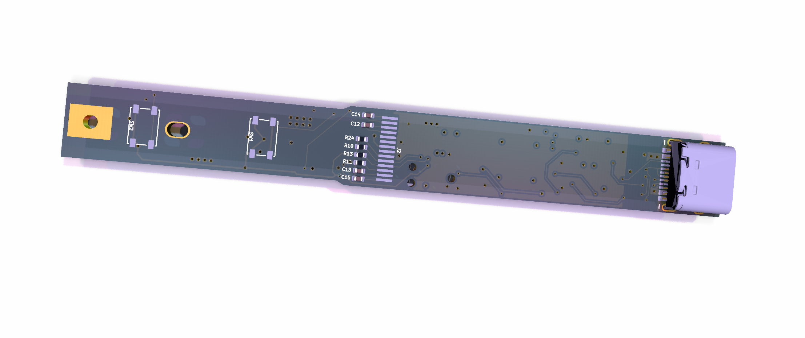

# Otter-Iron

Replacement PCB for TS100, adds USB-C PD to every hackers favorite tool!

Hardware is finished and working, software V0.1!

Todo Software:
 - [ ] Write a better regulation
 - [ ] Current measurement
 - [ ] Store last setpoint
 - [ ] Better Fonts/UI
 - [ ] PD-Profile cycling
 

