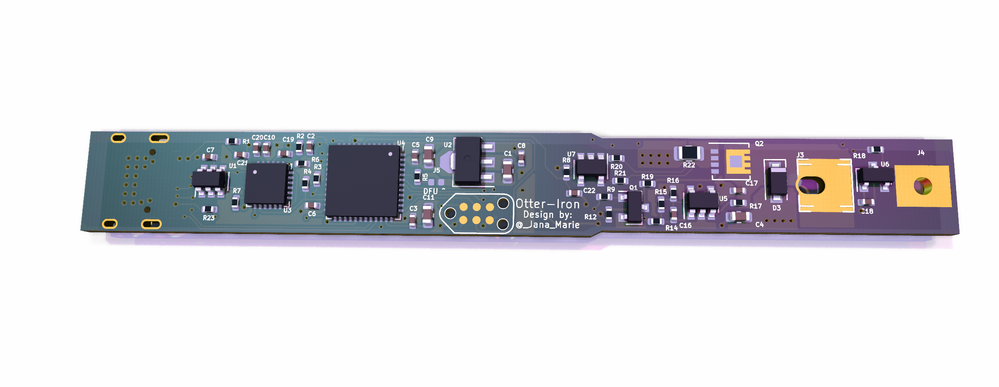

# Otter-Iron

Replacement PCB for TS100, adds USB-C PD to every hackers favorite tool!

Hardware is finished and working, software V0.1 is released!

Features:
 - You can solder!
 - Tmperature can be adjusted via buttons
 - USB-PD requests highest voltage
 - Display shows set-temperature, temperature and input-voltage
 - Designed by an Otter *chirps* :3

## Ordering and assmebly instructions

The BOM can be found at [KiCAD/production/kitspace_bom.csv](KiCAD/production/kitspace_bom.csv). Most parts are generic parts, which can be ordered and assembled regulary. However the display and tip-holders need special attention. The PCB has to be ordered with a thickness of 1mm (1.6mm works too, but 1mm has a better fit).

### Tip-Holders / mechanical parts

The original tip-holders are custom made thus it is not possible to buy them, if you already have a TS100 it is highly recommended to recycle those. They can be unscrewed, cut to size and soldered/screwed onto the Otter-Iron. This is the preferred option!

If you don't own a TS100 you can buy one from miniware (price ranges from 35$ to 45$) and harvest the parts (as well as the casing and tip!).

You can also buy the littlefuse fuseholders mentioned in the BOM. Those however have a very bad fit, you have to bend them and add a little solder notch, otherwise you may destroy your tips. In addition to this solution you also need to buy a spare case+tip which is ~25-35$, this is the least preferred option.

### Display

The display can be bought from LCSC or Aliexpress, I haven't found it at Mouser yet. It is the last part to be assembled, it is soldered on the back of the pcb facing the PCB and the tip-end. 

## Flashing

To flash the Otter-Iron short the DFU-jumper shown in the image below while plugging it into your computer. This will put the iron into DFU mode allowing you to flash it via DFU/USB. Run this command to flash the downloaded binary.

    $ dfu-util -a 0 -s 0x08000000:leave -D firmware.bin

## Video

[Video (clickme)](https://twitter.com/JanHenrikH/status/1208867279540232192)

## Images

## Todo software

 - [ ] Write a better regulation
 - [ ] Current measurement
 - [ ] Store last setpoint
 - [ ] Better Fonts/UI
 - [ ] PD-Profile cycling
 
## Todo Hardware

Todo next hardware revision:
 - [ ] Add barrel jack
 - [ ] Add grounding solution
